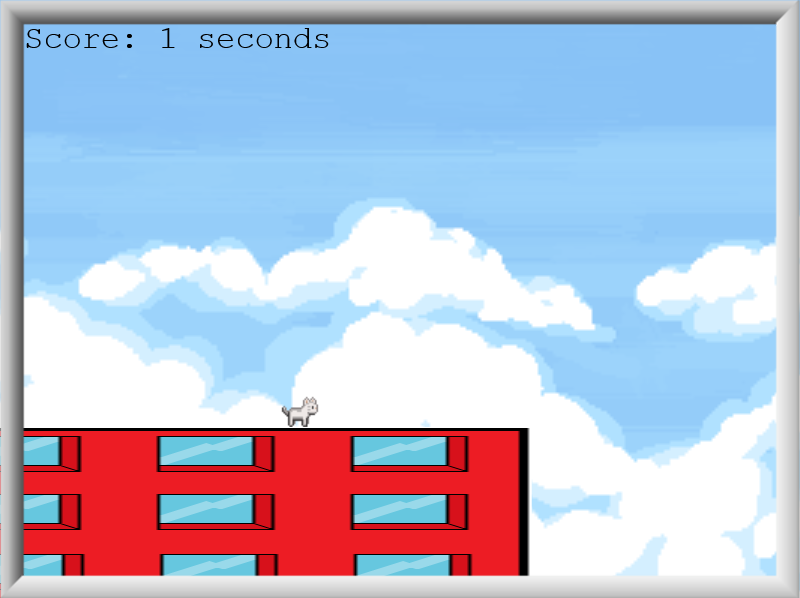
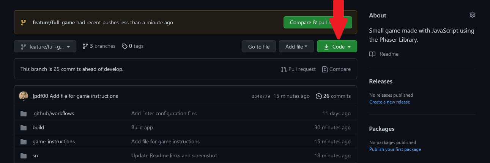
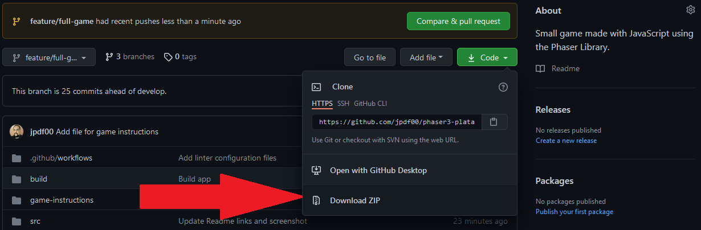

# Cat Jump

> A small plataformer game built wiht Javascript and Phaser 3.

[Click Here  to read the game instructions](./game-instructions)

## Built With

- JavaScript, CSS, HTML.
- Phaser 3
- Webpack, Jest, Babel, eslint, stylelint, webhint.

## Live Demo

[Play Cat Jump](https://cat-jump-jpdf00.netlify.app/)

## Getting Started

To get a local copy up and running follow these simple example steps.

- On the top of the page there is a green button name "Code"

- Click on the "Code" button.
- A Menu will appear click in "Download Zip"

- Save the "phaser3-plataformer-feature-full-game.zip" file on your computer.
- Extract the contents of the "phaser3-plataformer-feature-full-game.zip" you just downloaded in a folder.

### Prerequisites

- nodeJS.
- A browser.

### Setup

- Open your comand prompt.
- Go inside the folder "phaser3-plataformer-feature-full-game" (The one you extracted from the "phaser3-plataformer-feature-full-game.zip" file).
- Type `npm instal`.

### Usage

- Open your comand prompt.
- Go inside the folder "phaser3-plataformer-feature-full-game" (The one you extracted from the "phaser3-plataformer-feature-full-game.zip" file).
- Type `npm run start` (this should open a page in your default browser and the game should load).

### Run tests

- Open your comand prompt.
- Go inside the folder "phaser3-plataformer-feature-full-game" (The one you extracted from the "phaser3-plataformer-feature-full-game.zip" file).
- Type `npm run test`.

## Authors

👤 **João Paulo Dias França**

- GitHub: [@jpdf00](https://github.com/jpdf00)
- Twitter: [@jpdf00](https://twitter.com/jpdf00)
- LinkedIn: [João Paulo Dias França](https://www.linkedin.com/in/jpdf00/)

## 🤝 Contributing

Contributions, issues, and feature requests are welcome!

Feel free to check the [issues page](https://github.com/jpdf00/phaser3-plataformer/issues).

## Show your support

Give a ⭐️ if you like this project!

## Acknowledgments

- Hat tip to anyone whose code was used
- Inspiration
- etc

## 📝 License

This project is [MIT](./LICENSE) licensed.
